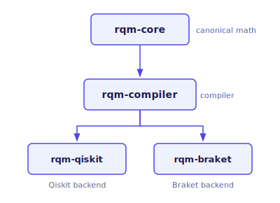

# RQM Documentation

**Status:** Active development · Production-ready architecture

> **Write once. Run on any quantum backend.**

RQM is a compiler-first quantum software platform that separates mathematical representation, compilation, and execution across multiple quantum backends.

It provides a backend-agnostic workflow where the same program can be compiled and executed on different runtimes such as Qiskit and Amazon Braket.

---

## Architecture Overview

RQM is structured as a layered pipeline from canonical math to backend execution:

| Layer | Repository | Responsibility |
|---|---|---|
| Math | [`rqm-core`](https://github.com/RQM-Technologies-dev/rqm-core) | Canonical representations: quaternions, spinors, Bloch vectors, SU(2) |
| Compiler | [`rqm-compiler`](https://github.com/RQM-Technologies-dev/rqm-compiler) | Instruction generation, gate normalization, and IR lowering |
| Execution | [`rqm-qiskit`](https://github.com/RQM-Technologies-dev/rqm-qiskit) | Qiskit circuit execution backend |
| Execution | [`rqm-braket`](https://github.com/RQM-Technologies-dev/rqm-braket) | AWS Braket execution backend |
| Optimization | [`rqm-optimize`](https://github.com/RQM-Technologies-dev/rqm-optimize) | SU(2)-aware circuit optimization and compression layer |
| Variational | [`rqm-pennylane`](https://github.com/RQM-Technologies-dev/rqm-pennylane) | Differentiable and variational workflow layer (PennyLane) |

The math layer has no backend dependency. The compiler layer transforms programs into a normalized instruction set. Execution backends consume that normalized form — they do not reimplement math or compiler logic.

---

## Start Here

If you are new to the platform, follow this path:

1. **[Quickstart](quickstart.md)** — install and run your first program in minutes.
2. **[Understand the ecosystem](ecosystem.md)** — see how each layer connects.
3. **[Explore the concepts](concepts.md)** — understand compiler-first design and backend abstraction.
4. **[Browse the API guides](api/rqm-core-api.md)** — reference the key modules and functions.

---

## What is RQM?

RQM is a compiler-first quantum software platform. It separates three concerns that are often conflated in quantum frameworks:

- **Mathematical representation** — handled by `rqm-core`, which defines canonical quaternion, spinor, and SU(2) structures with no backend dependency.
- **Compilation** — handled by `rqm-compiler`, which transforms those structures into a normalized instruction set that any backend can consume.
- **Execution** — handled by `rqm-qiskit` and `rqm-braket`, which map the compiled instructions onto their respective runtimes.
- **Optimization** — handled by `rqm-optimize`, which applies SU(2)-aware gate fusion and circuit compression before execution.
- **Differentiable workflows** — handled by `rqm-pennylane`, which exposes the RQM stack through PennyLane's device interface for variational algorithms and quantum machine learning.

This separation means the same program can run on Qiskit or Amazon Braket without modification. Swapping backends is a one-line change.

---

!!! note "🔷 Quaternionic Signal Processing (QSP)"
    RQM now includes **Quaternionic Signal Processing (QSP)** — a framework for applying quaternion-based mathematics to signal processing tasks. See the [QSP Overview](qsp/index.md) for the full stack documentation.

!!! tip "New: rqm-pennylane"
    **rqm-pennylane** is now part of the RQM ecosystem — a differentiable and variational workflow layer built on [PennyLane](https://pennylane.ai/). Use it to run variational algorithms, quantum machine learning models, and gradient-based optimization through the RQM stack. See the [Ecosystem overview](ecosystem.md).

---

!!! tip "New: rqm-optimize"
    **rqm-optimize** is now part of the RQM ecosystem — an SU(2)-aware circuit optimization and compression layer. Insert `optimize(qc)` between translation and execution to reduce gate count before hardware runs. See the [Optimization guide](optimization.md).

---

!!! tip "New to the platform?"
    Start with [Quickstart](quickstart.md) for a working example, then read [Concepts](concepts.md) to understand the architecture.

---

🌐 **Website:** [https://rqmtechnologies.com](https://rqmtechnologies.com)
